# 四章主题与知识点思维导图

## 总体逻辑

这四章的展开逻辑是：

业务系统产生交易数据 → 用 OLTP/relational database 保证业务数据正确保存 → 用 SQL 查询和加工数据 → 因为 OLTP 不适合复杂历史分析，所以建立 Data Warehouse/OLAP → 用 dimensional model 让分析更快更直观 → 用 ETL 把源系统数据稳定搬入 DW。

## Mermaid 思维导图

```mermaid
mindmap
  root((Financial Data Management and BI))
    Chapter 1: Database and OLTP
      Course goal
        Business data
        BI dashboard
        Decision support
      OLTP
        Daily operations
        Short transactions
        Insert and update heavy
        Current operational snapshot
        Transaction
          Commit
          Rollback
          Concurrency control
          Recovery
      Relational model
        Tables
          Rows
          Columns
        Keys
          Primary key
          Foreign key
        Integrity constraints
          Entity integrity
          Referential integrity
          Domain integrity
          User defined integrity
      ERD
        Entity
        Relationship
        Attribute
        Convert to tables
          Entity to table
          1:N with foreign key
          M:N with junction table
          Constraints
      Normalization
        Goal
          Reduce redundancy
          Improve integrity
        1NF
          Atomic values
          Unique rows
        2NF
          No partial dependency
        3NF
          No transitive dependency
        Limitation
          Many joins for analytics
    Chapter 2: SQL
      DDL
        CREATE TABLE
        Constraints
          Primary key
          Foreign key
          Unique
          Not null
          Check
      DML
        Insert
        Update
        Delete
      Query
        SELECT
        FROM
        WHERE
        ORDER BY
        DISTINCT
        LIMIT
      Join
        Inner join
        Left join
        Right join
        Full join
        Cross join
        Join condition
          PK equals FK
      Aggregation
        COUNT
        SUM
        AVG
        MIN
        MAX
        GROUP BY
        HAVING
        WHERE before grouping
        HAVING after grouping
      More SQL
        Set operators
          UNION
          UNION ALL
          INTERSECT
          MINUS or EXCEPT
        CASE
        IF
        Functions
          String
          Numeric
          Date and time
      Subquery and CTE
        Subquery
          Inline intermediate result
        CTE
          WITH
          Named temporary result
          Multi step logic
    Chapter 3: Data Warehouse and Dimensional Model
      Why DW
        OLTP analytics problem
          Historical data burden
          Complex joins
          Slow queries
          Interference with operations
      Data warehouse
        Subject oriented
        Integrated
        Historical
        Non volatile
        Optimized for reads
      OLTP vs OLAP
        OLTP
          Normalized
          Updates
          Current data
          Many users
        OLAP
          Denormalized
          Reads
          Full history
          Analysts
      Data mart
        Department subset
        Faster rollout
        Integration challenge
      Dimensional model
        Measures
          Numerical business facts
        Dimensions
          Business context
          Filtering
          Grouping
          Report labels
      Star schema
        Fact table
          Measures
          Foreign keys
          Grain
        Dimension tables
          Descriptive attributes
          Hierarchies
      Snowflake schema
        Normalized dimensions
        Less redundancy
        More joins
      Grain
        Meaning of one fact row
        Most important design decision
        Separate facts for separate grains
      Dimension design
        Surrogate key
        Natural key preservation
        Date dimension
        Time dimension
        Not applicable row
        Degenerate dimension
        Conformed dimension
        Slowly changing dimension
        Fast changing dimension
    Chapter 4: ETL
      ETL purpose
        Move source data into DW
        Make data query ready
      Extract
        Source systems
        Relevant data
        Full extract
        Delta extract
      Data staging area
        Transit storage
        Cleaning
        Transformation
        Restartability
        Lineage
      Transform
        Data type conversion
        Date format conversion
        Cleansing
        Deduplication
        Join lookup
        Aggregate
        Build surrogate keys
        Handle history
      Load
        Load dimensions first
        Load facts second
        Initial load
        Incremental update
        Load tools
        Parallelization
      ETL design constraints
        Business KPIs
        Compliance
        Data quality
        Security
        Latency
        Integration
        BI delivery
      Sakila example
        Define grain
        Prepare dimensions
        Join source tables
        Lookup dimension keys
        Group by grain
        Insert fact rows
```

## 章节之间的逻辑联系

Chapter 1 先回答“业务数据怎样被正确存起来”。OLTP 处理日常交易，relational model 用 tables、keys、constraints 保证数据结构清晰，ERD 帮助设计表，normalization 减少冗余并提高一致性。

Chapter 2 回答“存好的数据怎样被查询和加工”。SQL 是连接数据库理论和实际分析任务的工具，先会建表和简单查询，再会 join 多表、aggregation 汇总、subquery/CTE 拆解复杂问题。

Chapter 3 回答“为什么只会 OLTP 和 SQL 还不够”。当分析需要大量历史数据和复杂汇总时，OLTP 的 normalized design 会导致很多 join，影响性能，所以需要 Data Warehouse。DW 用 dimensional model、fact table、dimension table、star schema 来服务 OLAP。

Chapter 4 回答“DW 里的数据从哪里来、如何进去”。ETL 把 OLTP 和其他 source systems 的数据抽取出来，在 staging area 清洗、转换、整合，再按 DW 的 dimensional model 加载 dimensions 和 facts。

## 每章内部展开逻辑

Chapter 1 内部逻辑：

数据库重要性 → OLTP 业务交易需求 → relational model 的表结构 → keys 和 integrity constraints 保证正确性 → ERD 从业务到表设计 → normalization 解决冗余和更新异常。

Chapter 2 内部逻辑：

先建表和约束 → 再插入/更新/删除 → 用 SELECT 查询单表 → 用 JOIN 连接多表 → 用 GROUP BY/HAVING 做汇总 → 用 set operators、CASE、functions、subquery、CTE 处理更复杂问题。

Chapter 3 内部逻辑：

直接在 OLTP 上分析的问题 → DW 的定义和优势 → OLTP vs OLAP → dimensional model 的 measures/dimensions → star/snowflake schema → grain → dimension table 的高级设计。

Chapter 4 内部逻辑：

DW 需要周期性加载数据 → ETL 总流程 → DSA 作为中间层 → Extract 取数 → Transform 清洗整合 → Load 入仓 → dimensions before facts → initial load 和 incremental update → 实例演示如何生成 fact table。

